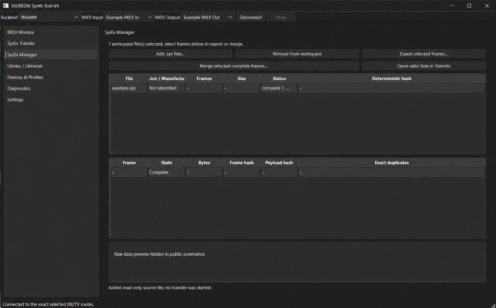

# TAUREON Synth Tool V4

TAUREON Synth Tool V4 is a native Windows desktop application for working with hardware synthesizers and other MIDI devices.



*Public preview: device names and file contents have been replaced with example placeholders.*

## Alpha releases

The [Windows x64 alpha releases](https://github.com/sscheidl/TAUREON-Synth-Tool-V4/releases) are experimental previews for interested users and contributors. Download the ZIP, extract the complete folder, and run `TAUREON-Synth-Tool-V4.exe`. Keep the DLLs, `resources`, and plugin folders next to the executable. No installer is provided.

Windows 11 x64 is the primary target. The WinMM backend uses Windows' native MIDI support. The Windows MIDI Services (WMS) backend of `0.1.0-alpha.2` targets the Developer Preview 9 API (`Windows.Devices.Midi2`); the ZIP does not contain Microsoft's preview API files, so WMS works only where Windows provides that API or you place permitted API files beside the executable. Otherwise Auto falls back to WinMM. The release does not change drivers or Windows MIDI configuration. Select the exact receive and transmit routes yourself before connecting.

For read-only backend diagnosis, run `TAUREON-Synth-Tool-V4.exe --list-midi wms`
or `--list-midi winmm` from a terminal in the portable folder (local builds use
`taureon_app.exe`). These commands list routes or the initialization error without
opening a MIDI endpoint or sending data.

Local development/test builds use the
[Preview 9 WMS API](docs/reference/WMS_PREVIEW9_DEPENDENCIES.md), with its DLL and
resource file beside the executable. Public CI downloads omit those Preview 9
files; WMS needs a permitted API obtained separately or supplied by Windows.
Developers acquire the pinned inputs with
`tools/AcquireWmsDependencies.ps1`. The first alpha (`0.1.0-alpha.1`) used the older
RC4 runtime.

The alpha is **not yet validated for real product-path MIDI/SysEx transfer or device restore**. Stage 5 remains open pending native 150%/200% display checks and physical-device testing in the application. Back up important synth data and use receive/inspection features first. The Summit profile currently supports bounded identification and inspection, not semantic preset editing or validated restore.

Developers are welcome to [contribute](CONTRIBUTING.md). The generic MIDI engine has an [experimental internal CMake package](docs/engine/REUSE.md); it is not a stable public SDK.

Its purpose is to replace a collection of fragmented, outdated, or unreliable MIDI/SysEx utilities with one coherent tool for modern Windows systems. TAUREON is intended to support both current USB MIDI devices and older DIN MIDI hardware without making the application depend on any one synthesizer.

The central product principle is:

> **Unknown devices work generically. Known devices gain additional intelligence through profiles or protocol modules.**

## What TAUREON is for

TAUREON combines five logical product domains:

1. **MIDI Monitor** — observe, filter, decode, and diagnose MIDI traffic.
2. **SysEx / Transfer / Conversion** — receive, save, inspect, send, compare, split, merge, and convert SysEx data.
3. **Librarian / Preset Management** — manage presets, banks, slots, and collections for supported devices.
4. **Devices & Profiles** — describe device identity, MIDI mappings, transfer rules, formats, and capabilities.
5. **Options / System** — configure application-wide behavior, diagnostics, appearance, logging, and safe defaults.

These are logical product domains. They do **not** require the GUI to contain exactly five tabs.

## Generic first, device-aware second

TAUREON remains useful without a device profile:

- generic MIDI monitoring works;
- raw SysEx receive/save/load/send works;
- unknown messages remain visible rather than guessed.

A matching profile may add:

- CC / NRPN / RPN names;
- symbolic value mappings;
- known SysEx message types;
- bank and slot organization;
- transfer pacing;
- warnings;
- supported file formats.

Where a device needs real logic—checksums, request/response handshakes, staged transfers, ACK/NAK handling, or non-trivial codecs—TAUREON uses a compiled protocol module rather than embedding programming logic in JSON.

## Reliability and data safety

TAUREON prioritizes correctness and observability over convenience.

Core rules:

- raw MIDI/SysEx data is not silently modified;
- malformed or incomplete data is reported as such;
- unknown formats are not repaired speculatively;
- imported files are not overwritten unnecessarily;
- raw send and validated restore are distinct workflows;
- destructive operations require explicit user action;
- device-specific behavior does not leak into generic transport code;
- the application does not silently modify Windows MIDI drivers, services, registry settings, or API mode.

A format may be supported for detection or inspection without claiming safe modification or restore.

## Technical framework

TAUREON V4 is a clean rebuild targeting:

- Windows 11 x64;
- C++20;
- Qt 6 Widgets;
- CMake;
- direct Windows MIDI Services integration;
- native WinMM compatibility support.

The shipped application must not require Python, `mido`, `python-rtmidi`, PortMidi, or a `midi.exe` subprocess transport.

The Qt-independent generic MIDI/SysEx/transfer library has an experimental
[standalone CMake package and consumer example](docs/engine/REUSE.md). Native
Windows backends and device-specific protocols are separate from that package.

## What TAUREON is not

TAUREON is not intended to be:

- a DAW;
- a sequencer or piano roll;
- an audio recorder/editor;
- a VST/AU host;
- a software synthesizer;
- a universal graphical parameter editor for every synth;
- firmware flashing software;
- automatic driver-management software.

Dedicated synth editors may exist separately without turning the TAUREON core into a device-specific application.

## Project status

V4 starts as a new codebase and new repository.

Confirmed local directory:

```text
D:\Eigene Dateien\Eigene Dokumente\Playground\TAUREON-Synth-Tool-V4
```

Legacy reference project:

```text
D:\Eigene Dateien\Eigene Dokumente\Playground\TAUREON-Synth-Tool
```

Legacy repository:

```text
https://github.com/sscheidl/TAUREON-Synth-Tool
```

The legacy project remains a reference for protocol facts, validated captures, fixtures, device research, and implementation lessons. It is not the architectural basis of V4.

V4 is experimental until the required software validation, independent review, and real hardware validation have passed.

## Documentation

The README describes the product only. Detailed project documentation lives under `docs/`.

Start with:

```text
docs/README.md
```
